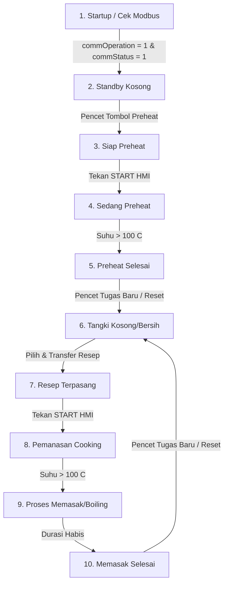

# DOKUMENTASI TRIAL PROJECT: SISTEM KONTROL STEAMBOX MANDIRI
## Pengembangan Sistem PC SCADA Haiwell & Pengendali Suhu Autonics TK4M
**Acuan Bahan Presentasi untuk Owner & Manajemen Pabrik**

---

## EXECUTIVE SUMMARY (RINGKASAN EKSEKUTIF)

Proyek ini bertujuan untuk mengotomatisasi kontrol suhu dan durasi memasak pada **30 Ruang Steambox** secara mandiri menggunakan **PC SCADA Runtime** dan **Autonics TK4M Controller** melalui komunikasi jaringan **Modbus TCP to RTU (ICP DAS Gateway)**. 

Desain sistem kontrol ini dirancang dengan berfokus pada dua pilar utama:
1.  **Reliabilitas OT Mutlak:** Sistem tidak bergantung pada koneksi internet/Wi-Fi luar ruangan, menjamin keselamatan proses memasak dari risiko jaringan mati.
2.  **Poka-Yoke (Anti-Salah Operasional):** Status banner pintar bertindak sebagai asisten pemandu bagi operator pabrik agar tidak salah langkah dalam menekan tombol, sekalipun operator awam komputer.

---

## 1. TOPOLOGI JARINGAN DAN ALIRAN DATA SISTEM

Berikut adalah skema topologi jaringan fisik dan integrasi data dari lapangan hingga ke server web aplikasi (Laravel):

```mermaid
flowchart TD
    subgraph Tangki Produksi (Lapangan)
        TK1["30 Unit Autonics TK4M (Modbus RTU RS-485)"]
    end

    subgraph ICP DAS Gateway (Ruang Panel)
        TGW["TGW-735CR Serial-to-Ethernet Gateway"]
        port1["Bus 1 (Port 502): Unit 1 - 10"]
        port2["Bus 2 (Port 503): Unit 11 - 20"]
        port3["Bus 3 (Port 504): Unit 21 - 30"]
    end

    subgraph Server Lokal (Ruang Kontrol / HMI)
        SCADA["PC Runtime Haiwell Cloud SCADA"]
    end

    subgraph Integrasi Sistem & Monitoring Cloud (IT)
        WebAPI["Haiwell SCADA WebAPI"]
        NodeJS["Node.js Middleware Server"]
        Laravel["Laravel Web Application & Database Log"]
    end

    %% Koneksi Fisik & Protokol
    TK1 -->|Bagi Bus RS-485| port1
    TK1 -->|Bagi Bus RS-485| port2
    TK1 -->|Bagi Bus RS-485| port3

    port1 -.->|Modbus TCP/IP Port 502| SCADA
    port2 -.->|Modbus TCP/IP Port 503| SCADA
    port3 -.->|Modbus TCP/IP Port 504| SCADA

    SCADA ===>|HTTP Request / JSON| WebAPI
    WebAPI ===> NodeJS
    NodeJS ===>|Data Sync & Logging| Laravel

    %% Styling
    classDef field fill:#dbeafe,stroke:#2563eb,stroke-width:2px,color:#1e3a8a;
    classDef gateway fill:#fef3c7,stroke:#d97706,stroke-width:2px,color:#78350f;
    classDef control fill:#d1fae5,stroke:#059669,stroke-width:2px,color:#065f46;
    classDef cloud fill:#f3e8ff,stroke:#7c3aed,stroke-width:2px,color:#5b21b6;

    class TK1 field;
    class TGW,port1,port2,port3 gateway;
    class SCADA control;
    class WebAPI,NodeJS,Laravel cloud;
```

### Penjelasan Komponen Topologi:
1.  **30 Unit Autonics TK4M (Modbus RTU RS-485):** Bertindak sebagai pengendali suhu fisik tangki di lapangan. Dibagi menjadi 3 kelompok bus serial RS-485 untuk menjaga kecepatan transmisi dan menghindari keterlambatan data (*packet loss*).
2.  **TGW-735CR Gateway (ICP DAS):** Mengonversi sinyal serial RS-485 dari Autonics ke protokol Ethernet Modbus TCP/IP. Gateway ini membagi bus komunikasi ke 3 port Ethernet virtual yang berbeda:
    *   **Port 502:** Melayani Unit 1 s.d 10.
    *   **Port 503:** Melayani Unit 11 s.d 20.
    *   **Port 504:** Melayani Unit 21 s.d 30.
3.  **PC Runtime Haiwell Cloud SCADA:** Bertindak sebagai stasiun master pengumpul data Modbus TCP/IP dari ketiga port gateway TGW-735CR secara paralel dan mengeksekusi logika otomatisasi (master loop).
4.  **WebAPI -> Node.js -> Laravel:** Data realtime dari SCADA diteruskan melalui jalur WebAPI ke middleware Node.js untuk diolah secara asinkron, kemudian dimasukkan ke database sistem Laravel untuk keperluan pembuatan laporan (*data log* produksi) dan dashboard web manajemen.

---

## 2. STRUKTUR DAN ARSITEKTUR DATABASE TAG HMI

Untuk menjaga efisiensi memori HMI SCADA dan kerapian struktur data, arsitektur database tag dibagi menjadi tiga kelompok utama:

### A. Tag Dinamis per Ruang (Di dalam Group `sb_1` s.d. `sb_30`)
Masing-masing dari 30 ruang Steambox memiliki penampung status mandiri di dalam group unitnya sendiri:
*   **`status_banner`** (STRING, panjang: 50): Menampilkan status rill dan instruksi bimbingan operator untuk unit bersangkutan (misalnya: `"STEAMBOX KOSONG"`, `"SIAP PEMANASAN..."`).
*   **`mode_preheat`** (BOOL): Sakelar penentu apakah unit sedang menjalankan pemanasan awal (Pre-heat) atau memasak resep (Cooking).
*   **`maintenance_mode`** (BOOL): Toggle HMI per unit untuk mengalihkan ke mode perbaikan manual. Jika bernilai `true`/`1`, seluruh logika otomatisasi skrip dilewati (*bypass*) agar teknisi dapat melakukan kontrol manual secara aman.
*   **`sensor_error`** (BOOL): Tag boolean penanda alarm jika sensor suhu bermasalah. Tag ini bernilai `true`/`1` jika suhu `>= 300.0 °C` (sensor putus/openloop) untuk memicu sirine alarm HMI atau log alarm.
*   **`reset`** (BOOL): Sakelar pemicu untuk melakukan reset parameter (Tugas Baru) per unit. Tombol ini dipisah sepenuhnya dari `status_kosong` untuk keandalan dan keamanan.
*   **`status_kosong`** (BOOL): Status penanda bahwa tangki kosong dan siap menerima perintah baru.
*   **`status_resep`** (BOOL): Penanda bahwa data resep masakan telah berhasil ditransfer ke memori tangki HMI.
*   **`status_pemanasan`** (BOOL): Status penanda bahwa unit sedang dalam fase pemanasan (Heating).
*   **`status_pemasakan`** (BOOL): Status penanda bahwa unit sedang dalam fase mendidih/pemasakan (Boiling).
*   **`status_selesai`** (BOOL): Penanda khusus bahwa proses memasak (Cooking) telah selesai. Bit ini **tidak menyala** saat siklus preheat selesai untuk menghindari ambigu indikator operator.
*   **`tampil_durasi_aktual`** (STRING): Format `"hh:mm:ss"` hitung mundur sisa waktu memasak.
*   **`durasi_aktual_up`** (STRING): Format `"hh:mm:ss"` hitung maju durasi rill pemasakan yang telah dilalui produk. Nilai ini yang digunakan untuk data log produksi dan disinkronkan secara simetris jika ada perubahan waktu (`adjust_menit`).
*   **`suhu_awal` / `suhu_akhir`** (SHORT): Mencatat suhu awal saat tombol start ditekan dan suhu akhir saat proses masak selesai.

### B. Tag Hardware & Komunikasi Modbus (Di dalam Device `sb1` s.d. `sb30`)
Tag fisik ini terhubung langsung ke register internal Autonics TK4M melalui Modbus RTU:
*   **`_commStatus`** (BOOL): Status koneksi fisik Modbus antara PC SCADA dengan controller Autonics di lapangan (1 = Terhubung/Online, 0 = Terputus/Offline).
*   **`_commOperation`** (BOOL): Sakelar polling komunikasi Modbus serial. HMI secara otomatis mematikan tag ini (`false`/`0`) saat startup untuk unit yang tidak aktif agar menghemat bandwidth RS485 dan menghindari error timeout.
*   **`temp`** (SHORT): Nilai pembacaan suhu aktual dari Autonics (Nilai raw, 1000 = 100.0 °C).
    *   **Diagnostik Sensor Error:** Skrip secara otomatis mendeteksi jika pembacaan `temp` bernilai **`>= 30000`** (setara dengan suhu **`>= 300.0 °C`**). Ini mendeteksi kondisi sensor rusak/putus (*Open-loop* atau batas atas *HHHH*).
    *   **Filosofi Pengendalian Aman:** Ketika sensor error terdeteksi, SCADA **tidak mengirimkan perintah STOP** ke Autonics. Pihak Autonics TK4M yang secara mandiri akan mempertahankan kondisi kerja pemanas terakhir demi melindungi kematangan produk yang sedang berjalan. SCADA hanya bertindak sebagai media informasi yang menampilkan pesan error sensor di layar untuk memandu tindakan pencegahan teknisi.
*   **`run_stop`** (BOOL): Perintah kerja heater Autonics (0 = RUN/Pemanas Menyala, 1 = STOP/Pemanas Mati).

### C. Tag Teks Kustom Global & Auto-Inisialisasi (Di dalam Group `Sys_Control`)
Untuk memudahkan pengaturan teks banner, teks kustomisasi disimpan secara **global** di dalam group `Sys_Control`. 

**Sistem Auto-Inisialisasi Pintar (Poka-Yoke Skrip):**
Pada saat startup, jika tag-tag teks di bawah ini bernilai kosong (`""` atau `undefined`), **skrip secara otomatis akan menuliskan nilai default ke dalam tag HMI tersebut**. Dengan demikian, operator langsung dapat melihat teks default di layar konfigurasi dan dapat mengubahnya kapan saja secara dinamis:

*   **`txt_status_kosong`** (STRING) -> Default: `"STEAMBOX KOSONG"`
*   **`txt_status_preheat`** (STRING) -> Default: `"SEDANG PEMANASAN"`
*   **`txt_status_pemanasan`** (STRING) -> Default: `"MENUNGGU MENDIDIH (< 100 C)"`
*   **`txt_status_pemasakan`** (STRING) -> Default: `"SEDANG MEMASAK (MENDIDIH)"`
*   **`txt_status_selesai`** (STRING) -> Default: `"PROSES SELESAI - SILAKAN KOSONGKAN TANGKI"`
*   **`txt_selesai_preheat`** (STRING) -> Default: `"PEMANASAN SELESAI - STEAMBOX SIAP UNTUK PEMASAKAN"`
*   **`txt_siap_preheat`** (STRING) -> Default: `"SIAP PEMANASAN - SILAKAN TEKAN START"`
*   **`txt_siap_cooking`** (STRING) -> Default: `"RESEP TERPASANG - SILAKAN TEKAN START"`
*   **`txt_status_resep`** (STRING) -> Default: `"RESEP TERPASANG - SILAKAN TEKAN START"`
*   **`txt_preheat_paused`** (STRING) -> Default: `"PRE-HEAT DIHENTIKAN (PAUSED)"`
*   **`txt_status_paused`** (STRING) -> Default: `"MESIN BERHENTI (PAUSED)"`
*   **`txt_status_maintenance`** (STRING) -> Default: `"MODE MAINTENANCE (KONTROL MANUAL)"`
*   **`txt_status_offline`** (STRING) -> Default: `"KONEKSI OFFLINE (MCB TRIP/ALAT MATI)"`
*   **`txt_status_disable`** (STRING) -> Default: `"UNIT TIDAK DIPAKAI"`
*   **`txt_status_sensor_error`** (STRING) -> Default: `"ERROR SENSOR (OPENLOOP/HHHH)"`
*   **`txt_sensor_error`** (STRING) -> Default: `"proses memasak, tetapi sensor error, cek segera !"`

---

## 3. WORKFLOW PROSES PRODUKSI STEAMBOX (10 TAHAP POKA-YOKE)

Skrip otomatisasi dan visualisasi banner dirancang dengan sangat disiplin untuk memandu operator melalui **10 tahap siklus produksi**:



### Penjelasan Detil Tiap Tahap:

#### Tahap 1: Startup & Proteksi Komunikasi (`_commOperation` vs `_commStatus`)
*   Jika unit dinonaktifkan (`_commOperation = 0`), status banner terkunci menampilkan **`txt_status_disable`** (`"UNIT TIDAK DIPAKAI"`). Polling Modbus ke Autonics dihentikan sepenuhnya demi efisiensi bandwidth kabel serial.
*   Jika unit diaktifkan (`_commOperation = 1`), skrip secara otomatis memantau koneksi Modbus:
    *   Jika `_commStatus = 0` (Disconnected): Banner menampilkan **`txt_status_offline`** (`"KONEKSI OFFLINE (MCB TRIP/ALAT MATI)"`).
    *   Jika `_commStatus = 1` (Connected): Status banner langsung terhubung ke status operasional unit. Jika unit baru menyala tanpa tugas, banner menampilkan **`txt_status_kosong`** (`"STEAMBOX KOSONG"`) dan mengatur bit `status_kosong = 1`.

#### Tahap 2: Persiapan Preheat
*   Pukul 06:45, operator mengaktifkan mode preheat harian (sakelar `$sb_i.mode_preheat` bernilai `true`/`1`).
*   Selama mesin masih berhenti (`run_stop = 1`), status banner membimbing operator dengan menampilkan **`txt_status_siap_preheat`** (`"SIAP PEMANASAN - SILAKAN TEKAN START"`).

#### Tahap 3: Proses Preheat Berjalan
*   Operator menekan tombol START (mengubah `run_stop` menjadi `0`/RUN).
*   Siklus preheat berjalan:
    *   Pemanas menyala, `status_pemanasan = true`, status banner menampilkan **`txt_status_preheat`** (`"SEDANG PEMANASAN"`).
    *   Durasi pemanasan dihitung maju (*count-up*) dan ditampilkan di kolom pemanasan.
    *   **Keamanan Tampilan:** Seluruh jam proses (`jam_mulai`, `jam_masak`, `jam_selesai`) dan `tampil_durasi_aktual` dikunci menampilkan tanda strip **`"--:--:--"`** atau **`"--"`** karena ini adalah fase preheat, bukan memasak produk.

#### Tahap 4: Akhir Siklus Preheat (Mati Otomatis & Banner Terkunci)
*   Suhu sensor Autonics menyentuh batas **`> 100.0 °C`** (nilai register Modbus `> 1000`).
*   Skrip langsung memutus pemanas secara otomatis dengan mengirimkan perintah `$sb{i}.run_stop = 1` (STOP), mematikan `status_pemanasan = false`, dan secara otomatis mematikan mode preheat (`mode_preheat = false`).
*   **Perlindungan Lampu Selesai:** Tag `status_selesai` **tetap bernilai `false`** untuk menghindari lampu selesai memasak menyala salah.
*   **Penguncian Banner:** Status banner menampilkan **`txt_selesai_preheat`** (`"PEMANASAN SELESAI - STEAMBOX SIAP UNTUK PEMASAKAN"`) dan terkunci di sana hingga operator menekan tombol Tugas Baru/Reset.

#### Tahap 5: Tugas Baru / Pencucian Tangki (Standalone Reset)
*   Operator memasukkan produk/adonan makanan baru ke ruang Steambox.
*   Operator menekan tombol **"Tugas Baru / Reset"** yang memicu sakelar `$sb_i.reset = true`.
*   Skrip mendeteksi sinyal reset dan langsung membersihkan memori sistem secara menyeluruh:
    *   Mematikan mode preheat (`mode_preheat = false`).
    *   Mengatur `status_kosong = true` dan mematikan `status_selesai = false` serta `status_resep = false`.
    *   Meriset semua jam proses (`jam_mulai`, `jam_masak`, `jam_selesai`) kembali ke **`"--:--:--"`**.
    *   Meriset seluruh durasi pemanasan, tampil_durasi_aktual, durasi_aktual_up, perubahan waktu, suhu awal/akhir ke `0` atau `"--"`.
    *   Membersihkan data resep master yang terpasang di memori (`recipe_kode` dikosongkan, `recipe_nama` kembali ke `"--"`).
    *   Mengembalikan status banner ke **`txt_status_kosong`** (`"STEAMBOX KOSONG"`).
    *   Mematikan kembali trigger tombol `$sb_i.reset = false`.

#### Tahap 6: Transfer Resep Masakan
*   Operator memilih menu resep di HMI dan menekan tombol "Transfer Resep".
*   Skrip transfer resep menyalin seluruh informasi resep ke memori unit, menyalakan **`status_resep = true`**, dan langsung mengatur banner ke **`txt_status_resep`** (`"RESEP TERPASANG - SILAKAN TEKAN START"`). Bit `status_kosong` otomatis mati karena tangki sekarang sudah memiliki tugas produksi.

#### Tahap 7: Mulai Proses Memasak (Cooking)
*   Operator menekan tombol START (mengubah `run_stop` menjadi `0`/RUN).
*   Skrip dideteksi permulaan masak dan **mencatat Jam Mulai tepat sekali** (`tampil_jam_mulai = waktuSekarangString`).
*   Sisa detik masak diisi penuh dari target menit resep, dan `durasi_aktual_up` (hitung maju) diinisialisasi dari `0`.

#### Tahap 8: Fase Pemanasan Cooking (< 100 C)
*   Selama suhu tangki masih di bawah **`100.0 °C`** (Modbus `temp < 1000`):
    *   `status_pemanasan = true` dan `status_pemasakan = false`.
    *   Status banner menampilkan **`txt_status_pemanasan`** (`"MENUNGGU MENDIDIH (< 100 C)"`).
    *   **Aturan Jam Selesai & Timer:** `tampil_durasi_aktual` (hitung mundur) dan `durasi_aktual_up` (hitung maju) dikunci (tidak berkurang/bertambah). Jam Selesai menampilkan **`"--:--:--"`** karena durasi pemasakan belum dimulai.
    *   **Drop Suhu:** Jika sebelumnya unit telah mendidih lalu suhu turun kembali, Jam Selesai dan monitor luar ruangan **tetap aktif ditampilkan** untuk menjaga keandalan pengawasan proses.

#### Tahap 9: Fase Pemasakan Mendidih / Boiling (>= 100 C) & Proteksi Sensor Error
*   Suhu tangki menyentuh dan melewati batas mendidih **`>= 100.0 °C`** (Modbus `temp >= 1000`):
    *   `status_pemanasan = false` dan `status_pemasakan = true`.
    *   Status banner menampilkan **`txt_status_pemasakan`** (`"SEDANG MEMASAK (MENDIDIH)"`).
    *   **Pencatatan Sekali:** Skrip mencatat Jam Masak (`tampil_jam_masak`) tepat sekali saat transisi masuk ke fase boiling.
    *   **Timer Sinkron:** `tampil_durasi_aktual` (hitung mundur) berkurang 1 detik tiap detik, dan `durasi_aktual_up` (hitung maju) bertambah 1 detik tiap detik.
    *   **Perubahan Waktu:** Jika operator melakukan penambahan/pengurangan waktu (`adjust_menit`), nilai sisa waktu dan hitung maju langsung dikompensasi secara simetris, dan perkiraan Jam Selesai langsung terupdate dinamis.
    *   **Sensor Error (HHHH):** Jika terjadi kerusakan sensor (`temp >= 30000`) saat proses masak berlangsung:
        *   Proses memasak **tetap dilanjutkan** (countdown dan count-up tetap berjalan).
        *   Nama ruang Steambox **tetap tampil di monitor luar**.
        *   Status banner berubah menampilkan **`txt_sensor_error`** (`"proses memasak, tetapi sensor error, cek segera !"`) sebagai peringatan visual kepada operator.

#### Tahap 10: Akhir Proses Memasak (Selesai Batch)
*   Durasi aktual memasak habis menyentuh angka `0`.
*   Skrip langsung memutus pemanas Autonics dengan mengirim perintah `$sb{i}.run_stop = 1` (STOP), mematikan `status_pemasakan = false`, dan menyalakan bit `status_selesai = true`.
*   Suhu akhir aktual dicatat dan status banner menampilkan **`txt_status_selesai`** (`"PROSES SELESAI - SILAKAN KOSONGKAN TANGKI"`).
*   Siklus kembali ke Tahap 5 saat operator menekan tombol Tugas Baru untuk batch berikutnya.
