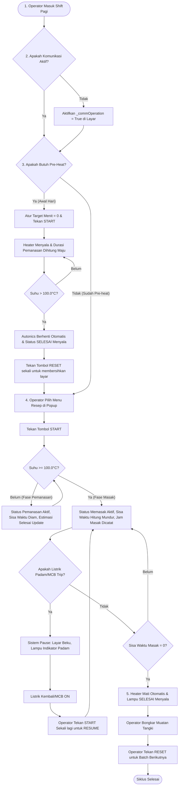

# LAPORAN DESAIN SISTEM KONTROL STEAMBOX
## Haiwell Cloud SCADA PC Runtime & Autonics TK4M Controller

Laporan ini memuat dokumentasi lengkap mengenai pengembangan, perubahan arsitektur, spesifikasi tag HMI/PLC, alur kerja operasional (SOP), serta skrip final JavaScript untuk sistem kontrol **30 Ruang Steambox** menggunakan PC SCADA Runtime dan Gateway **ICP DAS tGW-735 CR (Modbus TCP to RTU)**.

---

## 1. Daftar Perubahan Arsitektur & Optimalisasi Sistem

Untuk menjamin performa PC SCADA tetap ringan dan andal, berikut adalah perubahan utama yang telah kita lakukan:

*   **Penyederhanaan Tampilan (Single Dashboard HMI):**
    Kita melakukan unifikasi mode kerja. Cukup menggunakan **1 halaman display saja** untuk setiap unit. Skrip secara otomatis mendeteksi mode kerja berdasarkan nilai target resep:
    *   Jika `targetMenit === 0`, otomatis masuk ke **Mode Pre-heat Harian** (hitung maju, mati otomatis saat suhu > 100°C).
    *   Jika `targetMenit > 0`, otomatis masuk ke **Mode Pemasakan Resep** (hitung mundur, kalkulasi estimasi jam selesai, dan matikan otomatis jika waktu habis).
*   **Optimalisasi Skrip Master Loop (Anti-Lag):**
    Alih-alih menyalin skrip 250 baris sebanyak 30 kali, sistem dipersingkat menjadi **1 skrip tunggal** yang memproses unit-unit aktif menggunakan perulangan (*for-loop*) berbasis array `activeUnits = [29, 30]`. Hal ini meminimalisir penggunaan CPU SCADA PC.
*   **Bypass Komunikasi Dinamis (`_commOperation`):**
    Setiap unit dilengkapi sakelar kontrol komunikasi (`_commOperation`). Jika dinonaktifkan, SCADA tidak akan melakukan polling Modbus serial ke unit tersebut. Ini mencegah kemacetan (*clogging*) data dan error timeout komunikasi pada kabel RS485 ketika ada alat yang dimatikan.
*   **Sistem One-Shot Autoclear Tombol Reset:**
    Mengatasi masalah tombol Reset yang harus ditekan lama. Tombol Reset (`statusKosong`) dikonfigurasi sebagai tipe **Set Bit (ON terus)**, dan skrip secara otomatis mengembalikan statusnya ke **OFF (`false`)** dalam 1 detik setelah proses reset selesai dilakukan di memori.
*   **Proteksi Listrik Padam (Anti-Reset Timer ke 0):**
    Memanfaatkan retentive memory HMI (**Keep Value**). Jika listrik padam atau MCB trip di tengah jalan, durasi dan status masak terakhir tetap terjaga (beku/pause). Saat listrik kembali menyala, operator cukup menekan tombol START sekali untuk melanjutkan sisa waktu memasak.
*   **Fitur Monitor Luar Ruangan (Top 5 Finishing Soon):**
    Skrip otomatis menyaring dan mengurutkan secara naik (*ascending*) 5 unit Steambox yang sedang memasak dan akan segera selesai, guna memberikan panduan visual bagi operator lapangan untuk bersiap.

---

## 2. Kamus Tag Database SCADA

Berikut adalah daftar tag yang wajib didaftarkan di dalam Database Tag SCADA:

### A. Tag Internal HMI per Unit (`$SB_i`)
*Ganti indeks `i` dengan nomor unit (misal: `$SB_29.targetMenit`, `$SB_30.targetMenit`)*

| Nama Tag HMI | Tipe Data | Keterangan |
| :--- | :---: | :--- |
| **`mode_preHeat`** | Boolean | Toggle HMI untuk mengaktifkan pemanasan awal (Pre-heat). *Catatan: Tidak wajib jika menggunakan skema unifikasi targetMenit = 0.* |
| **`targetMenit`** | Integer | Input target durasi masak dari menu resep HMI (Menit). |
| **`adjustMenit`** | Integer | Input koreksi tambah/kurang waktu dari operator saat proses berjalan (Menit). |
| **`sisaDetikMasak`** | Integer | **(Wajib Keep Value)** Menyimpan sisa waktu memasak berjalan (Detik). |
| **`totalDetikPemanasan`**| Integer | **(Wajib Keep Value)** Menyimpan total akumulasi waktu pemanasan (Detik). |
| **`flagInitStart`** | Integer | **(Wajib Keep Value)** Flag penanda inisialisasi awal tombol Start (0 atau 1). |
| **`flagInitMasak`** | Integer | **(Wajib Keep Value)** Flag penanda pencatatan jam mendidih pertama kali (0 atau 1). |
| **`statusKosong`** | Boolean | Trigger tombol Reset / Kosongkan Tangki dari layar HMI. |
| **`statusPemanasan`** | Boolean | Lampu indikator status unit sedang dalam fase pemanasan (< 100°C). |
| **`statusPemasakan`** | Boolean | Lampu indikator status unit sedang dalam fase mendidih/memasak (>= 100°C). |
| **`statusSelesai`** | Boolean | Lampu indikator status unit telah menyelesaikan proses memasak. |
| **`statusBanner`** | String(40) | Teks dinamis yang menampilkan kondisi rill unit (misal: "SEDANG MEMASAK"). |
| **`tampilJamMulai`** | String(10) | Menampilkan jam mulai proses (Format: `"HH:MM:SS"`). |
| **`tampilJamMasak`** | String(10) | Menampilkan jam mulai mendidih (Format: `"HH:MM:SS"`). |
| **`tampilJamsSelesai`** | String(10) | Menampilkan perkiraan jam selesai masak (Format: `"HH:MM:SS"`). |
| **`tampilPemanasan`** | String(10) | Menampilkan durasi waktu pemanasan berjalan (Format: `"HH:MM:SS"`). |
| **`tampilDurasiAktual`** | String(10) | Menampilkan sisa waktu hitung mundur masak (Format: `"HH:MM:SS"`). |

### B. Tag Kontrol Sistem Global (`$Sys_Control`)
| Nama Tag HMI | Tipe Data | Keterangan |
| :--- | :---: | :--- |
| **`maintenanceMode[i]`** | Integer | Bit penanda mode perbaikan untuk unit `i`. (Contoh: `maintenanceMode29`). |
| **`monitor_room_[1-5]`** | String(15) | Menampilkan nama Steambox 5 teratas yang akan segera selesai (Rank 1 s.d. 5). |
| **`monitor_sisa_[1-5]`** | String(15) | Menampilkan sisa waktu Steambox 5 teratas yang akan segera selesai. |
| **`monitor_selesai_[1-5]`**| String(15) | Menampilkan jam perkiraan selesai Steambox 5 teratas. |

### C. Tag Hardware / Modbus PLC External (`$SBi`)
*Tag ini langsung dipetakan ke register Modbus RTU Autonics TK4M via gateway tGW-735*

| Nama Tag SCADA | Tipe Data | Modbus RTU Address / Hak Akses | Keterangan |
| :--- | :---: | :---: | :--- |
| **`_commOperation`** | Boolean | Internal SCADA / Read & Write | Mengaktifkan (1) atau menonaktifkan (0) polling Modbus ke Autonics. |
| **`_commStatus`** | Boolean | Internal SCADA / Read Only | Status koneksi fisik kabel serial (1 = Connect, 0 = Disconnect). |
| **`runStop`** | Boolean | Coil Read & Write / PLC Register | Sinyal RUN/STOP pemanas Autonics (0 = RUN, 1 = STOP). |
| **`temp`** | Integer | Input Register Read Only / PLC Register| Membaca suhu aktual sensor (Nilai raw, 1000 = 100.0 °C). |
| **`tempSet`** | Integer | Holding Register Read & Write | Pengaturan batas target suhu pemanasan Autonics. |

---

## 3. Alur Kerja (Workflow) Operasional - Bahan Acuan SOP

Berikut adalah rincian tahapan operasional sistem yang dapat Anda gunakan sebagai acuan penyusunan Standar Operasional Prosedur (SOP) di pabrik:



---

## 4. Skrip JavaScript Master Loop Final (Copy-Paste Ready)

Skrip tunggal ini menangani pemrosesan logika untuk unit aktif yang didaftarkan pada array `activeUnits`, sekaligus menyortir dan menampilkan 5 unit teratas yang akan segera selesai pada layar luar ruangan.

Daftarkan skrip ini dengan trigger **Timer 1 Detik (1000ms)** di Haiwell SCADA Develop Anda:

```javascript
// ============================================================================
// SYSTEM KONTROL MASTER STEAMBOX & MONITOR OUTDOOR (30 UNIT)
// Trigger: Timer 1 Detik (1000ms)
// ============================================================================

// 1. Ekstrak Waktu Sistem (Format HH:MM:SS)
var waktuSekarangString = ("0" + ($Hour || 0)).slice(-2) + ":" + ("0" + ($Minute || 0)).slice(-2) + ":" + ("0" + ($Second || 0)).slice(-2);
var totalDetikSekarang = (($Hour || 0) * 3600) + (($Minute || 0) * 60) + ($Second || 0);

// 2. DAFTAR UNIT YANG AKTIF DIDAFTARKAN (Uji Coba Trial: Unit 29 & 30)
// Jika nanti unit lain sudah dipasang & didaftarkan tag-nya, cukup tambahkan nomor unitnya ke array di bawah
var activeUnits = [29, 30]; 

// Array penampung unit yang sedang memasak untuk sistem monitor luar ruangan
var runningRooms = [];

// ============================================================================
// LOOPING UTAMA: PROSES LOGIKA STEAMBOX INDIVIDU
// ============================================================================
for (var k = 0; k < activeUnits.length; k++) {
    var i = activeUnits[k]; // Mendapatkan ID Unit (misal: 29 atau 30)

    var deviceName = "SB" + i;
    var hmiGroupName = "SB_" + i;

    // Cek Keaktifan Polling dari HMI (Operator Control)
    var commOperation = GetTagValue(deviceName + "._commOperation");
    
    if (commOperation === true) {
        
        // Cek Status Hubungan Fisik Modbus (Hardware Connection)
        var commStatus = GetTagValue(deviceName + "._commStatus");
        
        // --- KONDISI ONLINE (KONEKSI NORMAL) ---
        if (commStatus === true) {
            
            // Isolasi Register Data
            var maintenance_aktif = GetTagValue("Sys_Control.maintenanceMode" + i) || 0;
            var Run_status = GetTagValue(deviceName + ".runStop"); // true = STOP, false = RUN
            var raw_pv = GetTagValue(deviceName + ".temp") || 0;

            var modePreHeat = GetTagValue(hmiGroupName + ".mode_preHeat") || false;
            var target = GetTagValue(hmiGroupName + ".targetMenit") || 0;
            var adjust = GetTagValue(hmiGroupName + ".adjustMenit") || 0;
            var sisa = GetTagValue(hmiGroupName + ".sisaDetikMasak") || 0;
            var pemanasan = GetTagValue(hmiGroupName + ".totalDetikPemanasan") || 0;
            var fStart = GetTagValue(hmiGroupName + ".flagInitStart") || 0;
            var fMasak = GetTagValue(hmiGroupName + ".flagInitMasak") || 0;

            var bit_kosong = GetTagValue(hmiGroupName + ".statusKosong") || false;
            var bit_pemanasan = GetTagValue(hmiGroupName + ".statusPemanasan") || false;
            var bit_pemasakan = GetTagValue(hmiGroupName + ".statusPemasakan") || false;
            var bit_selesai = GetTagValue(hmiGroupName + ".statusSelesai") || false;

            var hPre = 0; var mPre = 0; var sPre = 0;
            var hAct = 0; var mAct = 0; var sAct = 0;
            var est = 0; var hEst = 0; var mEst = 0; var sEst = 0;
            
            var statusText = "";

            if (maintenance_aktif !== 1) {
                
                // --- A. KONDISI MESIN STOPPED / STANDBY / PAUSE (runStop === true) ---
                if (Run_status === true) {
                    bit_pemanasan = false;
                    bit_pemasakan = false;
                    fStart = 0; // Reset flag agar bisa trigger inisialisasi saat di-start kembali

                    if (bit_kosong === true) {
                        bit_selesai = false;
                        fStart = 0;
                        fMasak = 0;
                        pemanasan = 0;
                        sisa = 0;
                        SetTagValue(hmiGroupName + ".targetMenit", 0);
                        SetTagValue(hmiGroupName + ".adjustMenit", 0);

                        SetTagValue(hmiGroupName + ".tampilJamMulai", "00:00:00");
                        SetTagValue(hmiGroupName + ".tampilJamMasak", "00:00:00");
                        SetTagValue(hmiGroupName + ".tampilJamsSelesai", "00:00:00");
                        SetTagValue(hmiGroupName + ".tampilDurasiAktual", "00:00:00");
                        SetTagValue(hmiGroupName + ".tampilPemanasan", "00:00:00");
                        
                        statusText = "TANGKI KOSONG - SIAP MEMULAI";
                        bit_kosong = false; // AUTOCLEAR: Tombol Reset kembali OFF secara otomatis
                    } else if (bit_selesai === true) {
                        statusText = "PROSES SELESAI - SILAKAN KOSONGKAN TANGKI";
                    } else {
                        statusText = "MESIN BERHENTI (PAUSED)";
                    }
                } 
                
                // --- B. KONDISI MESIN RUNNING (runStop === false) ---
                else if (Run_status === false) {
                    bit_kosong = false;
                    bit_selesai = false;

                    // MODE PRE-HEAT HARIAN (Jika resep kosong / target = 0)
                    if (target === 0) {
                        bit_pemanasan = true;
                        bit_pemasakan = false;
                        
                        statusText = "SEDANG PRE-HEAT (PEMANASAN)";

                        if (fStart === 0) {
                            SetTagValue(hmiGroupName + ".tampilJamMulai", waktuSekarangString);
                            SetTagValue(hmiGroupName + ".tampilJamMasak", "--:--:--");
                            SetTagValue(hmiGroupName + ".tampilJamsSelesai", "--:--:--");
                            SetTagValue(hmiGroupName + ".tampilDurasiAktual", "--:--:--");
                            fStart = 1;
                            pemanasan = 0;
                        }

                        pemanasan = pemanasan + 1;
                        hPre = Math.floor(pemanasan / 3600);
                        mPre = Math.floor((pemanasan % 3600) / 60);
                        sPre = pemanasan % 60;
                        SetTagValue(hmiGroupName + ".tampilPemanasan", ("0" + hPre).slice(-2) + ":" + ("0" + mPre).slice(-2) + ":" + ("0" + sPre).slice(-2));

                        // Pemanasan selesai jika suhu Autonics > 100°C (1000 raw)
                        if (raw_pv > 1000) {
                            Run_status = true; // Kirim perintah STOP (runStop = true)
                            bit_selesai = true;
                            bit_pemanasan = false;
                            fStart = 0;
                        }
                    } 
                    
                    // MODE PEMASAKAN RESEP (Jika target > 0)
                    else {
                        if (fStart === 0) {
                            SetTagValue(hmiGroupName + ".tampilJamMulai", waktuSekarangString);
                            SetTagValue(hmiGroupName + ".tampilJamMasak", "--:--:--");
                            SetTagValue(hmiGroupName + ".tampilJamsSelesai", "--:--:--");
                            fStart = 1;
                            sisa = target * 60;
                            pemanasan = 0;
                            fMasak = 0;
                        }

                        // Fitur Koreksi Waktu (Adjust +/-)
                        if (adjust !== 0) {
                            sisa = sisa + (adjust * 60);
                            if (sisa < 0) { sisa = 0; }
                            adjust = 0;
                            SetTagValue(hmiGroupName + ".adjustMenit", 0); // Clear input HMI
                        }

                        // Fase B1: Suhu Belum Mendidih (Pemanasan Awal Masak)
                        if (raw_pv < 1000) {
                            bit_pemanasan = true;
                            bit_pemasakan = false;
                            pemanasan = pemanasan + 1;
                            
                            statusText = "MENUNGGU MENDIDIH (< 100 C)";

                            hPre = Math.floor(pemanasan / 3600);
                            mPre = Math.floor((pemanasan % 3600) / 60);
                            sPre = pemanasan % 60;
                            SetTagValue(hmiGroupName + ".tampilPemanasan", ("0" + hPre).slice(-2) + ":" + ("0" + mPre).slice(-2) + ":" + ("0" + sPre).slice(-2));

                            hAct = Math.floor(sisa / 3600);
                            mAct = Math.floor((sisa % 3600) / 60);
                            sAct = sisa % 60;
                            SetTagValue(hmiGroupName + ".tampilDurasiAktual", ("0" + hAct).slice(-2) + ":" + ("0" + mAct).slice(-2) + ":" + ("0" + sAct).slice(-2));

                            est = (totalDetikSekarang + sisa) % 86400;
                            hEst = Math.floor(est / 3600);
                            mEst = Math.floor((est % 3600) / 60);
                            sEst = est % 60;
                            SetTagValue(hmiGroupName + ".tampilJamsSelesai", ("0" + hEst).slice(-2) + ":" + ("0" + mEst).slice(-2) + ":" + ("0" + sEst).slice(-2));
                        }
                        // Fase B2: Suhu Mendidih (Proses Memasak Berjalan)
                        else if (raw_pv >= 1000) {
                            bit_pemanasan = false;
                            bit_pemasakan = true;
                            
                            statusText = "SEDANG MEMASAK (MENDIDIH)";

                            // Kunci jam mulai memasak pertama kali
                            if (fMasak === 0) {
                                SetTagValue(hmiGroupName + ".tampilJamMasak", waktuSekarangString);
                                fMasak = 1;
                            }

                            if (sisa > 0) { sisa = sisa - 1; }

                            // Deteksi selesai memasak
                            if (sisa <= 0) {
                                sisa = 0;
                                Run_status = true; // Kirim perintah STOP (runStop = true)
                                bit_pemasakan = false;
                                bit_selesai = true;
                                fStart = 0;
                                fMasak = 0;
                            }

                            hAct = Math.floor(sisa / 3600);
                            mAct = Math.floor((sisa % 3600) / 60);
                            sAct = sisa % 60;
                            SetTagValue(hmiGroupName + ".tampilDurasiAktual", ("0" + hAct).slice(-2) + ":" + ("0" + mAct).slice(-2) + ":" + ("0" + sAct).slice(-2));

                            est = (totalDetikSekarang + sisa) % 86400;
                            hEst = Math.floor(est / 3600);
                            mEst = Math.floor((est % 3600) / 60);
                            sEst = est % 60;
                            SetTagValue(hmiGroupName + ".tampilJamsSelesai", ("0" + hEst).slice(-2) + ":" + ("0" + mEst).slice(-2) + ":" + ("0" + sEst).slice(-2));

                            // Masukkan ke daftar antrean monitor luar jika proses memasak aktif
                            runningRooms.push({
                                id: i,
                                name: "Steambox " + i,
                                sisa: sisa,
                                tampilSisa: ("0" + hAct).slice(-2) + ":" + ("0" + mAct).slice(-2) + ":" + ("0" + sAct).slice(-2),
                                tampilSelesai: ("0" + hEst).slice(-2) + ":" + ("0" + mEst).slice(-2) + ":" + ("0" + sEst).slice(-2)
                            });
                        }
                    }
                } 
                // --- C. KONDISI MAINTENANCE ACTIVE ---
                else {
                    statusText = "MODE MAINTENANCE (KONTROL MANUAL)";
                }
            } 
            // --- D. KONDISI OFFLINE (KONEKSI PUTUS) ---
            else {
                statusText = "KONEKSI OFFLINE (MCB TRIP/ALAT MATI)";
                SetTagValue(hmiGroupName + ".statusPemanasan", false);
                SetTagValue(hmiGroupName + ".statusPemasakan", false);
            }
        } 
        // --- E. KONDISI OPERASI DISABLED ---
        else {
            statusText = "KOMUNIKASI UNIT DINONAKTIFKAN";
            SetTagValue(hmiGroupName + ".statusPemanasan", false);
            SetTagValue(hmiGroupName + ".statusPemasakan", false);
            SetTagValue(hmiGroupName + ".statusSelesai", false);
        }

        // Tulis Banner Status ke HMI
        SetTagValue(hmiGroupName + ".statusBanner", statusText);

        // Write Back Register Data Utama
        SetTagValue(deviceName + ".runStop", Run_status);
        SetTagValue(hmiGroupName + ".statusKosong", bit_kosong);
        SetTagValue(hmiGroupName + ".statusPemanasan", bit_pemanasan);
        SetTagValue(hmiGroupName + ".statusPemasakan", bit_pemasakan);
        SetTagValue(hmiGroupName + ".statusSelesai", bit_selesai);
        SetTagValue(hmiGroupName + ".sisaDetikMasak", sisa);
        SetTagValue(hmiGroupName + ".totalDetikPemanasan", pemanasan);
        SetTagValue(hmiGroupName + ".flagInitStart", fStart);
        SetTagValue(hmiGroupName + ".flagInitMasak", fMasak);
    }
}

// ============================================================================
// SYSTEM SORTING & FILTER MONITOR OUTDOOR (TOP 5 FINISHING SOON)
// ============================================================================

// 1. Sortir unit memasak terkecil ke terbesar berdasarkan sisa detik
runningRooms.sort(function(a, b) {
    return a.sisa - b.sisa;
});

// 2. Tulis ke 5 slot tag monitor luar ruangan
for (var r = 1; r <= 5; r++) {
    if (r - 1 < runningRooms.length) {
        var room = runningRooms[r - 1];
        SetTagValue("Sys_Control.monitor_room_" + r, room.name);
        SetTagValue("Sys_Control.monitor_sisa_" + r, room.tampilSisa);
        SetTagValue("Sys_Control.monitor_selesai_" + r, room.tampilSelesai);
    } else {
        // Kosongkan baris monitor jika unit aktif kurang dari 5
        SetTagValue("Sys_Control.monitor_room_" + r, "--");
        SetTagValue("Sys_Control.monitor_sisa_" + r, "--:--:--");
        SetTagValue("Sys_Control.monitor_selesai_" + r, "--:--:--");
    }
}
```

---

## 5. Panduan Konfigurasi di HMI SCADA

Untuk memastikan kenyamanan operator dan menghindari kesalahan operasional, konfigurasikan tombol HMI dengan parameter berikut:

1.  **Tombol Reset / Kosongkan Tangki (`statusKosong`):**
    *   **Jenis Aksi:** Atur menjadi **Set Bit / Set High** (bukan Momentary). Skrip di atas akan secara otomatis mematikannya kembali ke `false` setelah reset berhasil dilakukan (sistem autoclear).
2.  **Visibilitas Tombol (Poka-Yoke):**
    *   **Tombol Pilih Resep:** Masukkan kondisi *Enable* hanya saat `$SB_i.flagInitStart == 0` (hanya bisa ganti resep saat mesin mati).
    *   **Tombol Start:** Masukkan kondisi *Enable* saat `$SB_i.statusSelesai == 0` (memaksa operator melakukan reset tangki sebelum memulai batch baru).
3.  **Halaman Layar Luar Ruangan:**
    *   Buat sebuah halaman HMI khusus berisi **Tabel 5 Baris**.
    *   Hubungkan baris 1 s.d 5 dengan tag-tag `$Sys_Control.monitor_room_x`, `$Sys_Control.monitor_sisa_x`, dan `$Sys_Control.monitor_selesai_x`. Halaman ini dapat ditampilkan pada monitor luar ruangan untuk acuan operator lapangan.
