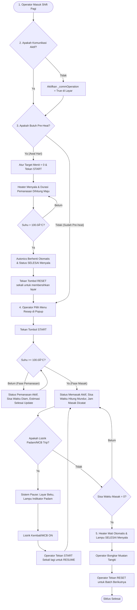

# LAPORAN DESAIN SISTEM KONTROL STEAMBOX
## Haiwell Cloud SCADA PC Runtime & Autonics TK4M Controller

Laporan ini memuat dokumentasi lengkap mengenai pengembangan, perubahan arsitektur, spesifikasi tag HMI/PLC, alur kerja operasional (SOP), serta skrip final JavaScript untuk sistem kontrol **30 Ruang Steambox** menggunakan PC SCADA Runtime dan Gateway **ICP DAS tGW-735 CR (Modbus TCP to RTU)**.

---

## 1. Daftar Perubahan Arsitektur & Optimalisasi Sistem

Untuk menjamin performa PC SCADA tetap ringan dan andal, berikut adalah perubahan utama yang telah kita lakukan:

*   **Penyederhanaan Tampilan (Single Dashboard HMI):**
    Kita melakukan unifikasi mode kerja. Cukup menggunakan **1 halaman display saja** untuk setiap unit. Skrip secara otomatis mendeteksi mode kerja berdasarkan nilai target resep:
    *   Jika `targetMenit === 0`, otomatis masuk ke **Mode Pre-heat Harian** (hitung maju, mati otomatis saat suhu > 100°C).
    *   Jika `targetMenit > 0`, otomatis masuk ke **Mode Pemasakan Resep** (hitung mundur, kalkulasi estimasi jam selesai, dan matikan otomatis jika waktu habis).
*   **Optimalisasi Skrip Master Loop (Anti-Lag & Dinamis):**
    Alih-alih menyalin skrip 250 baris sebanyak 30 kali, atau menggunakan daftar array statis, skrip tunggal ini secara dinamis melacak keaktifan polling Modbus dari unit 1 s.d 30 via tag `_commOperation` secara langsung saat runtime. Jika dinonaktifkan, unit dilewati (*bypass*), meminimalisir penggunaan CPU SCADA PC.
*   **Bypass Komunikasi Dinamis (`_commOperation`):**
    Setiap unit dilengkapi sakelar kontrol komunikasi (`_commOperation`). Jika dinonaktifkan, SCADA tidak akan melakukan polling Modbus serial ke unit tersebut. Ini mencegah kemacetan (*clogging*) data dan error timeout komunikasi pada kabel RS485 ketika ada alat yang dimatikan.
*   **Sistem One-Shot Autoclear Tombol Reset:**
    Mengatasi masalah tombol Reset yang harus ditekan lama. Tombol Reset (`statusKosong`) dikonfigurasi sebagai tipe **Set Bit (ON terus)**, dan skrip secara otomatis mengembalikan statusnya ke **OFF (`false`)** dalam 1 detik setelah proses reset selesai dilakukan di memori.
*   **Proteksi Listrik Padam (Anti-Reset Timer ke 0):**
    Memanfaatkan retentive memory HMI (**Keep Value**). Jika listrik padam atau MCB trip di tengah jalan, durasi dan status masak terakhir tetap terjaga (beku/pause). Saat listrik kembali menyala, operator cukup menekan tombol START sekali untuk melanjutkan sisa waktu memasak.
*   **Fitur Monitor Luar Ruangan (Top 5 Finishing Soon):**
    Skrip otomatis menyaring dan mengurutkan secara naik (*ascending*) 5 unit Steambox yang sedang memasak dan akan segera selesai, guna memberikan panduan visual bagi operator lapangan untuk bersiap.

---

## 2. Kamus Tag Database SCADA

Berikut adalah daftar tag yang wajib didaftarkan di dalam Database Tag SCADA:

### A. Tag Internal HMI per Unit (`$sb_i`)
*Ganti indeks `i` dengan nomor unit (misal: `$sb_29.target_menit`, `$sb_30.target_menit`)*

| Nama Tag HMI | Tipe Data | Keterangan |
| :--- | :---: | :--- |
| **`is_active`** | Boolean | Menandakan apakah Steambox unit `i` terpasang dan aktif secara fisik (1 = Aktif, 0 = Nonaktif). Diatur dari layar konfigurasi HMI. |
| **`maintenance_mode`** | Integer/Boolean | Bit penanda mode perbaikan untuk unit `i`. (0 = Normal, 1 = Maintenance). |
| **`mode_preHeat`** | Boolean | Toggle HMI untuk mengaktifkan pemanasan awal (Pre-heat). *Catatan: Tidak wajib jika menggunakan skema unifikasi target_menit = 0.* |
| **`target_menit`** | Integer | Input target durasi masak dari menu resep HMI (Menit). |
| **`adjust_menit`** | Integer | Input koreksi tambah/kurang waktu dari operator saat proses berjalan (Menit). |
| **`sisa_detik_masak`** | Integer | **(Wajib Keep Value)** Menyimpan sisa waktu memasak berjalan (Detik). |
| **`total_detik_pemanasan`**| Integer | **(Wajib Keep Value)** Menyimpan total akumulasi waktu pemanasan (Detik). |
| **`flag_init_start`** | Integer | **(Wajib Keep Value)** Flag penanda inisialisasi awal tombol Start (0 atau 1). |
| **`flag_init_masak`** | Integer | **(Wajib Keep Value)** Flag penanda pencatatan jam mendidih pertama kali (0 atau 1). |
| **`status_kosong`** | Boolean | Trigger tombol Reset / Kosongkan Tangki dari layar HMI. |
| **`status_pemanasan`** | Boolean | Lampu indikator status unit sedang dalam fase pemanasan (< 100°C). |
| **`status_pemasakan`** | Boolean | Lampu indikator status unit sedang dalam fase mendidih/memasak (>= 100°C). |
| **`status_selesai`** | Boolean | Lampu indikator status unit telah menyelesaikan proses memasak. |
| **`status_banner`** | String(40) | Teks dinamis yang menampilkan kondisi rill unit (misal: "SEDANG MEMASAK"). |
| **`tampil_jam_mulai`** | String(10) | Menampilkan jam mulai proses (Format: `"HH:MM:SS"`). |
| **`tampil_jam_masak`** | String(10) | Menampilkan jam mulai mendidih (Format: `"HH:MM:SS"`). |
| **`tampil_jam_selesai`** | String(10) | Menampilkan perkiraan jam selesai masak (Format: `"HH:MM:SS"`). |
| **`tampil_pemanasan`** | String(10) | Menampilkan durasi waktu pemanasan berjalan (Format: `"HH:MM:SS"`). |
| **`tampil_durasi_actual`** | String(10) | Menampilkan sisa waktu hitung mundur masak (Format: `"HH:MM:SS"`). |
| **`suhu_awal`** | Integer | **(Wajib Keep Value)** Menyimpan nilai suhu awal saat proses memasak dimulai (Nilai raw, 1000 = 100.0 °C). |
| **`suhu_akhir`** | Integer | **(Wajib Keep Value)** Menyimpan nilai suhu akhir saat proses memasak selesai (Nilai raw, 1000 = 100.0 °C). |
| **`perubahan_waktu`** | Integer | **(Wajib Keep Value)** Menyimpan akumulasi perubahan waktu +/- yang diinput operator (Menit). |

### B. Tag Kontrol Sistem Global (`$Sys_Control`)
| Nama Tag HMI | Tipe Data | Keterangan |
| :--- | :---: | :--- |
| **`monitor_room_[1-5]`** | String(15) | Menampilkan nama Steambox 5 teratas yang akan segera selesai (Rank 1 s.d. 5). |
| **`monitor_sisa_[1-5]`** | String(15) | Menampilkan sisa waktu Steambox 5 teratas yang akan segera selesai. |
| **`monitor_selesai_[1-5]`**| String(15) | Menampilkan jam perkiraan selesai Steambox 5 teratas. |
| **`txt_status_kosong`** | String(50) | Kustomisasi teks status tangki kosong (Default: "TANGKI KOSONG - SIAP MEMULAI"). |
| **`txt_status_preheat`** | String(50) | Kustomisasi teks status sedang pre-heat (Default: "SEDANG PRE-HEAT (PEMANASAN)"). |
| **`txt_status_pemanasan`** | String(50) | Kustomisasi teks status menunggu mendidih (Default: "MENUNGGU MENDIDIH (< 100 C)"). |
| **`txt_status_pemasakan`** | String(50) | Kustomisasi teks status sedang memasak (Default: "SEDANG MEMASAK (MENDIDIH)"). |
| **`txt_status_selesai`** | String(50) | Kustomisasi teks status proses selesai (Default: "PROSES SELESAI - SILAKAN KOSONGKAN TANGKI"). |
| **`txt_status_maintenance`**| String(50) | Kustomisasi teks status mode maintenance (Default: "MODE MAINTENANCE (KONTROL MANUAL)"). |
| **`txt_status_offline`** | String(50) | Kustomisasi teks status offline/mati (Default: "KONEKSI OFFLINE (MCB TRIP/ALAT MATI)"). |
| **`txt_status_disable`** | String(50) | Kustomisasi teks status polling nonaktif (Default: "KOMUNIKASI UNIT DINONAKTIFKAN"). |
| **`txt_status_sensor_error`**| String(50) | Kustomisasi teks status sensor error (Default: "ERROR SENSOR (OPENLOOP/HHHH)"). |

### C. Tag Hardware / Modbus PLC External (`$SBi`)
*Tag ini langsung dipetakan ke register Modbus RTU Autonics TK4M via gateway tGW-735*

| Nama Tag SCADA | Tipe Data | Modbus RTU Address / Hak Akses | Keterangan |
| :--- | :---: | :---: | :--- |
| **`_commOperation`** | Boolean | Internal SCADA / Read & Write | Mengaktifkan (1) atau menonaktifkan (0) polling Modbus ke Autonics. |
| **`_commStatus`** | Boolean | Internal SCADA / Read Only | Status koneksi fisik kabel serial (1 = Connect, 0 = Disconnect). |
| **`runStop`** | Boolean | Coil Read & Write / PLC Register | Sinyal RUN/STOP pemanas Autonics (0 = RUN, 1 = STOP). |
| **`temp`** | Integer | Input Register Read Only / PLC Register| Membaca suhu aktual sensor (Nilai raw, 1000 = 100.0 °C). |
| **`tempSet`** | Integer | Holding Register Read & Write | Pengaturan batas target suhu pemanasan Autonics. |

### D. Tag Internal HMI Resep & Parameter Aktif (`$recipe` & `$recipe_xxxx`)

| Nama Tag HMI | Tipe Data | Keterangan |
| :--- | :---: | :--- |
| **`$recipe.pilih_steambox`** | Integer | Menyimpan nomor kamar target sebelum operator memilih resep. |
| **`$recipe.durasi`** | Integer | Durasi target memasak dari resep terpilih (Menit). |
| **`$recipe.kode`** | String | Kode SKU produk resep. |
| **`$recipe.nama`** | String | Nama produk resep. |
| **`$recipe.versi`** | Integer | Versi resep. |
| **`$recipe.warna`** | String | Tanda warna produk resep. |
| **`$recipe.qty`** | Integer | Jumlah standar quantity resep. |
| **`$recipe.batch`** | Integer | **(BARU)** Nomor batch produksi resep berjalan. |
| **`$recipe.trolly`** | String | **(BARU)** Kode identifikasi troli yang digunakan. |
| **`$recipe_kode.[i]`**  | String | Menyimpan kode resep aktif untuk unit `i`. |
| **`$recipe_nama.[i]`**  | String | Menyimpan nama produk resep aktif untuk unit `i`. |
| **`$recipe_versi.[i]`**  | Integer | Menyimpan versi resep aktif untuk unit `i`. |
| **`$recipe_warna.[i]`**  | String | Menyimpan warna resep aktif untuk unit `i`. |
| **`$recipe_qty.[i]`**    | Integer | Menyimpan quantity resep aktif untuk unit `i`. |
| **`$recipe_batch.[i]`**  | Integer | Menyimpan nomor batch aktif untuk unit `i`. |
| **`$recipe_trolly.[i]`**  | String | Menyimpan kode troli aktif untuk unit `i`. |

---

## 3. Alur Kerja (Workflow) Operasional - Bahan Acuan SOP

Berikut adalah rincian tahapan operasional sistem yang dapat Anda gunakan sebagai acuan penyusunan Standar Operasional Prosedur (SOP) di pabrik:

---

## 4. Skrip JavaScript Master Loop Final (Copy-Paste Ready)

Skrip tunggal ini menangani pemrosesan logika untuk unit aktif menggunakan variabel literal $ secara statis untuk memenuhi pembatasan preprocessor Haiwell SCADA Develop, sekaligus menyortir dan menampilkan 5 unit teratas yang akan segera selesai pada layar luar ruangan.

Untuk menghindari beban CPU dan mencegah software Haiwell SCADA freeze, skrip ini dioptimalkan dengan **Early Exit** (hanya memproses unit aktif) serta **Conditional Write-Back** (hanya menulis ke register jika nilai berubah).

Daftarkan skrip ini dengan trigger **Timer 1 Detik (1000ms)** di Haiwell SCADA Develop Anda:

Skrip master loop lengkap dipisahkan ke file tersendiri untuk menjaga keandalan pembacaan dokumen. Anda dapat menyalin dan menggunakan kode dari file berikut:

- **File Skrip SCADA:** [master_loop_scada.js](file:///d:/Project/PTSIAP/Haiwell/Runtime/Demo2_hp_SB16/master_loop_scada.js)

Daftarkan skrip dari file tersebut dengan trigger **Timer 1 Detik (1000ms)** di Haiwell SCADA Develop Anda.

---

## 5. Panduan Konfigurasi di HMI SCADA

Untuk memastikan kenyamanan operator dan menghindari kesalahan operasional, konfigurasikan tombol HMI dengan parameter berikut:

1.  **Tombol Reset / Kosongkan Tangki (`statusKosong`):**
    *   **Jenis Aksi:** Atur menjadi **Set Bit / Set High** (bukan Momentary). Skrip di atas akan secara otomatis mematikannya kembali ke `false` setelah reset berhasil dilakukan (sistem autoclear).
2.  **Visibilitas Tombol (Poka-Yoke):**
    *   **Tombol Pilih Resep:** Masukkan kondisi *Enable* hanya saat `$SB_i.flagInitStart == 0` (hanya bisa ganti resep saat mesin mati).
    *   **Tombol Start:** Masukkan kondisi *Enable* saat `$SB_i.statusSelesai == 0` (memaksa operator melakukan reset tangki sebelum memulai batch baru).
3.  **Halaman Layar Luar Ruangan:**
    *   Buat sebuah halaman HMI khusus berisi **Tabel 5 Baris**.
    *   Hubungkan baris 1 s.d 5 dengan tag-tag `$Sys_Control.monitor_room_x`, `$Sys_Control.monitor_sisa_x`, dan `$Sys_Control.monitor_selesai_x`. Halaman ini dapat ditampilkan pada monitor luar ruangan untuk acuan operator lapangan.

---

## 6. Analisis Filosofi Desain: Poka-Yoke, Separation of Concerns, & Kemandirian Pabrik

Untuk menjamin kelangsungan operasional pabrik jangka panjang tanpa ketergantungan pada pihak ketiga (*vendor lock-in*), arsitektur sistem ini dirancang dengan memisahkan wilayah kerja antara **Teknologi Operasional pabrik (OT)** dan **Teknologi Informasi kantor (IT)**.

### A. Perbandingan Keandalan: Web App Vendor vs SCADA Mandiri

| Aspek Kontrol & Desain | Web App Vendor (Laravel + Bridge)  `[1.jpeg - 8.jpeg]` | Desain SCADA Mandiri Anda  `[Haiwell SCADA Direct]` | **Analisis Poka-Yoke (Error Proofing)** |
| :--- | :--- | :--- | :--- |
| **Ketergantungan Jaringan (Wi-Fi/Internet)** | **Sangat Tinggi (Risiko Tinggi)**  Tombol kontrol (seperti *Stop Pemasakan*) diakses lewat browser. Perintah harus lewat internet ke Laravel Server, lalu turun ke Bridge App via MQTT/Internet. | **Nol / Mandiri (Sangat Aman)**  HMI SCADA terhubung langsung kabel fisik RS485 ke Autonics. Kontrol mati-hidup dikirim langsung tanpa butuh internet. | **Poka-Yoke Fisik:** Jika Wi-Fi pabrik putus saat memasak, sistem vendor gagal mematikan mesin (produk gosong/rusak). Sistem SCADA Anda **tetap berfungsi 100%** mematikan mesin tepat waktu karena logika berjalan lokal. |
| **Metode Input Resep & Waktu** | **Form Input Web**  Memungkinkan pengetikan manual (angka) durasi memasak di halaman web. | **Kunci Database HMI (`120:Resep`)**  Operator dipaksa memilih SKU produk yang sudah terdaftar. Waktu diisi otomatis oleh database resep. | **Poka-Yoke Operasional:** Mencegah *typo* operator (misal ingin input `15` menit tapi terketik `150` menit). Pada SCADA Anda, operator tidak bisa mengetik angka durasi secara acak. |
| **Kunci Kondisi Start (Interlocking)** | **Tombol Selalu Aktif**  Tombol "Mulai Tugas Baru" di web bisa diklik kapan saja selama status unit adalah STOP. | **Interlock Visibilitas Tombol**  Tombol START di-disable jika tangki belum di-RESET/dikosongkan (`status_selesai = 1`). | **Poka-Yoke Urutan Proses:** Mencegah operator memulai batch memasak baru di tangki yang masih berisi produk batch sebelumnya karena tombol START terkunci sebelum tangki dibilas/kosong. |
| **Proteksi Gangguan Sensor (Open-Loop)** | **Umumnya Auto-Shutdown**  Jika sensor error (pembacaan suhu `32767`), program web biasanya crash atau langsung mematikan pemanas. | **Isolasi Logika Sensor**  Suhu `32767` dideteksi sebagai alarm banner, namun status pemanas (`runStop`) dibiarkan di posisi terakhir agar produk tidak rusak. | **Poka-Yoke Kerusakan Produk:** Mencegah produk di dalam tangki menjadi rusak setengah matang akibat sensor error sesaat. Pemanasan tetap jalan, dan operator diberitahu lewat teks banner HMI secara presisi. |
| **Peralihan Mode (Pre-heat vs Masak)** | **Diatur secara Terpisah**  Tampilan dan tombol untuk pemanasan harian dan resep biasanya dipisah di web. | **Unifikasi Target Waktu**  Jika target = `0` (Pre-heat), jika target `> 0` (Memasak). Logika ditentukan otomatis oleh HMI. | **Poka-Yoke Pemilihan Mode:** Mengurangi jumlah tombol di layar. Operator tidak akan salah menekan tombol mode karena sistem SCADA Anda yang mendeteksinya secara otomatis dari nilai target resep. |

---

### B. Kemandirian Pabrik (Bebas dari Vendor Lock-In)

Menggunakan standar industri **Haiwell Cloud SCADA** memberikan keunggulan mutlak dibandingkan solusi *custom-coding* berbasis web yang ditawarkan oleh vendor:

1.  **Kemudahan Pemeliharaan (Maintainability):**
    *   **Masalah Vendor:** Jika ada perubahan logika kontrol pada aplikasi Laravel vendor, pabrik harus memanggil programer web khusus dengan biaya mahal untuk melakukan coding ulang (mengubah rute backend, *controller*, dan *database migration*).
    *   **Solusi SCADA:** Proyek Haiwell SCADA menggunakan konfigurasi grafis standar industri dan skrip JavaScript ES5 dasar. Teknisi instrumen pabrik atau engineer OT/IT awam sekalipun dapat dengan mudah membaca, memodifikasi, dan memperbaiki logika program menggunakan software Haiwell SCADA Develop yang gratis.
2.  **Kemudahan Pengembangan (Expandability):**
    *   **Masalah Vendor:** Penambahan mesin baru (misalnya unit Steambox 31 s.d. 40) membutuhkan penulisan ulang kode database server, pemetaan API baru di Laravel, serta konfigurasi ulang program Bridge serial COM5.
    *   **Solusi SCADA:** Untuk menambah unit baru di SCADA, engineer pabrik cukup membuat grup tag baru (misal `SB_31`), menduplikasikan kartu visual di layar dashboard, dan memasukkan nomor unit tersebut ke dalam daftar array loop utama. Seluruh proses selesai dalam hitungan menit tanpa menyentuh baris kode IT yang rumit.
3.  **Separation of Concerns (Pemisahan Tanggung Jawab):**
    *   Logika kontrol fisik mutlak dikuasai oleh sistem OT pabrik (SCADA/PLC).
    *   Server Laravel IT milik Owner cukup bertindak sebagai penerima data (membaca file `OperationLog.db` atau menerima JSON) untuk kebutuhan analisis bisnis, statistik produksi, dan rekap manajemen tanpa membebani atau membahayakan keselamatan mesin-mesin di lantai pabrik.

